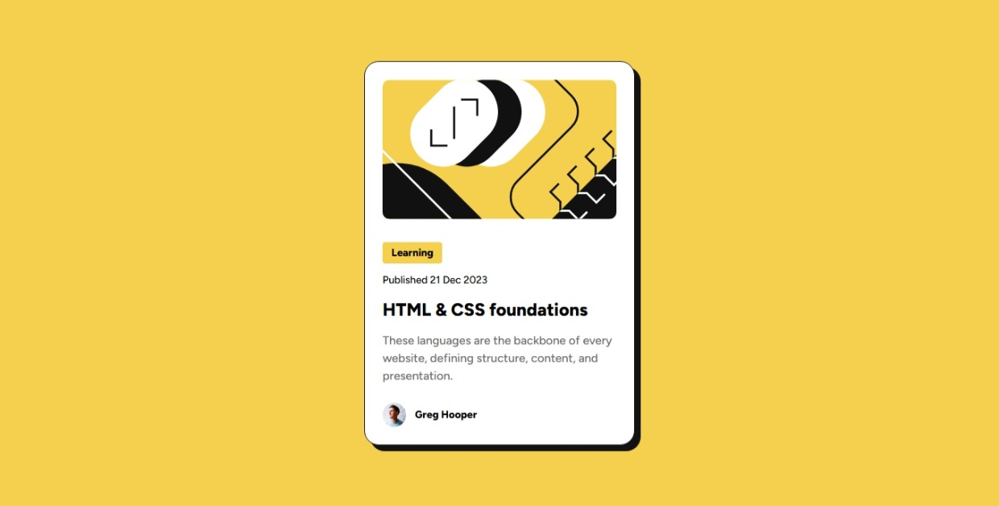

# Frontend Mentor - Blog preview card solution

This is my solution to the [Blog preview card challenge on Frontend Mentor](https://www.frontendmentor.io/challenges/blog-preview-card-ckPaj01IcS).
## Table of contents

- [Overview](#overview)
  - [The challenge](#the-challenge)
  - [Screenshot](#screenshot)
  - [Links](#links)
- [My process](#my-process)
  - [Built with](#built-with)
  - [What I learned](#what-i-learned)
- [Author](#author)
- [Acknowledgments](#acknowledgments)

## Overview
This is my first time trying a Frontend Mentor challenge. I chose the blog preview card design because it's simple and well designed. I liked the visual layout and wanted to test my skills with it. Although it's a small component, it covers many core ideas and has been a great opportunity to get familiar with my development workflow.

### The challenge
-Make a pixel perfect card.
-Users should be able to See hover and focus states for all interactive elements on the page

### Screenshot

### Links

- Solution URL: [Add solution URL here](https://your-solution-url.com)
- Live Site URL: [Add live site URL here](https://your-live-site-url.com)

## My process
I used only vanilla HTML-CSS for this project. I began by setting up a basic design system with custom properties for colors, typography, and spacing. After that, I created utility classes to speed up styling. Then I moved on to the HTML markup, structured the layout, and started applying my utility classes. Finally, I refined the design by replacing fixed font sizes and widths with a more fluid, responsive approach using clamp().

### Built with
- Only Vanilla HTML-CSS
- Semantic HTML5 markup
- CSS custom properties
- Custom utility classes
- Flexbox
- fluid layout using clamp

### What I learned
I learned how to use clamp for font size and width instead of media queries.

## Author
- Website - (https://www.guenifi.com)
- Frontend Mentor - [@zakaria-guenifi](https://www.frontendmentor.io/profile/zakaria-guenifi)

## Acknowledgments
I used the clamp font size generator tool, it helped me figure out the grow factor for the font sizes without having to guess random vw values. I definitely recommend it to anyone starting out who wants to get the hang of fluid typography without overcomplicating things.